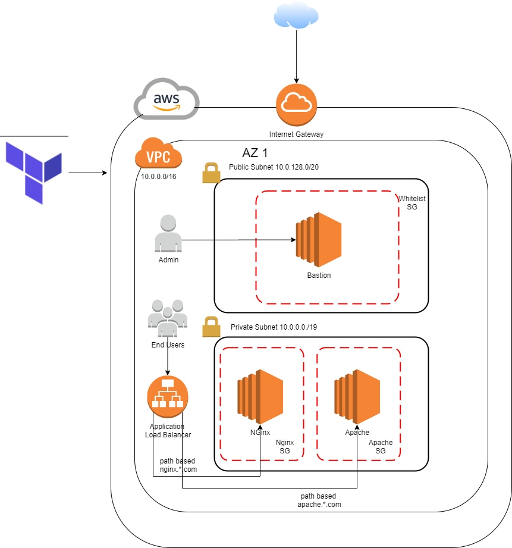

# Basic Two-Tier AWS Architecture

This provides a simple two-tier architecture on Amazon Web services. 

The premise is that you have stateless app servers running behind
an ALB serving traffic.

This example will also create a new EC2 Key Pair in the specified AWS Region. 
The key name and path to the public key must be specified via the  
terraform command vars.

Ww will create 1 bastion host for adminsitration and 2 EC2 instances in the private IP




After you run `terraform apply` on this configuration, it will
automatically output the DNS address of the ELB. After your instance
registers, this should respond with the default nginx web page.

To run, configure your AWS provider as described in 

https://www.terraform.io/docs/providers/aws/index.html

Run with a command like this:

```
terraform apply -var 'public_key={your_ssh_public_key}' \
   -var 'private_key_path={location_of_your_key_in_your_local_machine}' \
   -var 'key_name={key_name}'    
```

r53_zoneid SSL_ARN needed to deploy route

For example:

```
terraform apply -var 'public_key=ssh-rsa AAAAB3NzaC1yc2EAAAADAQABAAABAQCohXWgFUTuzH1Jmbo+TB+b85kR/7D/0Lvx/m38hNUGPfJRZCvdkAALOgfVnAWt66Q7V1VJ7q9VJhwiDgVjI08qE6FBdOk1mrvyXaqo00zHIRjpZGKcMHZgzDx6n/r89IUKSOr7/ATHNY98xpARB5RKgHyspQlmXzC+tJcRLDzLnTh2Zmu7GQSU+BLmIpTv3/9pzItbgFREw6xhxCg31E+FTGuDDPzW5SXCYiWS8u9XBbmx/asdnU/r0OuOvLeA5gX7YBU/PdCxO8uCoC6C4Fk2t3a6caG60NYuHYUDF5Ou83DHy+m74K2rPFYSbmMWdwiNhjIngUmsMwffBFQu0puX my-east1' \
   -var 'private_key_path=~'/.ssh/my-east1.pem' \
   -var 'key_name=my-east-1'    
```
